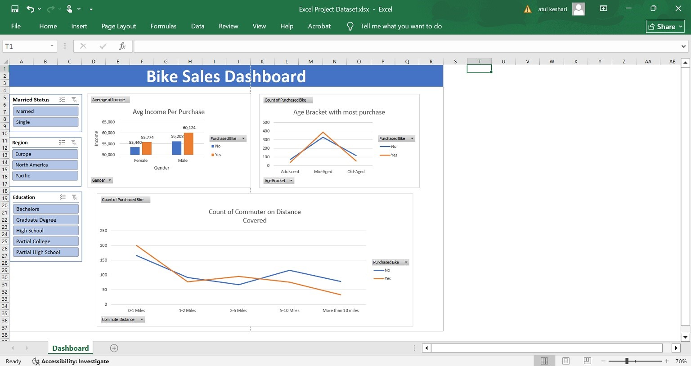

# 🚴 Bike Sales Performance Dashboard | MS Excel  

An **interactive Excel dashboard** created to analyze **Bike Sales Performance**, uncover insights, and support data-driven decision making.  

---

## 🖼️ Dashboard Preview 

---

## 📊 Key Insights
-  Average income analysis of bike owners, classified by gender.  
-  Commuter behavior based on distance covered by bike purchasers.  
-  Age-group segmentation to identify health-conscious demographics.  

---

## 📂 Files Included
- `ExcelProjectDataset.xlsx` → Cleaned dataset with final dashboard.  

---

## 🔎 Data Preparation Approach
1. **Data Preservation** → Duplicated raw dataset to keep the original intact.  
2. **Data Cleaning** → Removed duplicates, renamed columns, and dropped unnecessary fields (kept city, state, province, country, and pin).  
3. **Standardization** → Converted abbreviations (M → Male, F → Female) and reformatted currency into numeric values.  
4. **Segmentation** → Grouped ages into brackets (Adolescent, Middle-aged, Senior) for deeper insights.  

---

## 📈 Visualization & Features
-  **Pivot Tables** → Summarized bike sales performance.  
-  **Bar & Line Charts** → Trends and comparative analysis.  
-  **Slicers** → Interactive filtering for dynamic insights.  

---

##  How to Use
1. Download the file: [`ExcelProjectDataset.xlsx`](./data/ExcelProjectDataset.xlsx).  
2. Open in **MS Excel (2016 or later)**.  
3. Use slicers and filters to explore insights interactively.  

---

## 💡 Learnings
- Hands-on practice in **data cleaning** and **transformation**.  
- Built **interactive dashboards** using pivot tables, charts, and slicers.  
- Improved ability to turn **raw data into meaningful insights**.  

---
